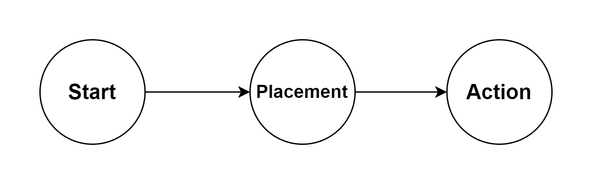
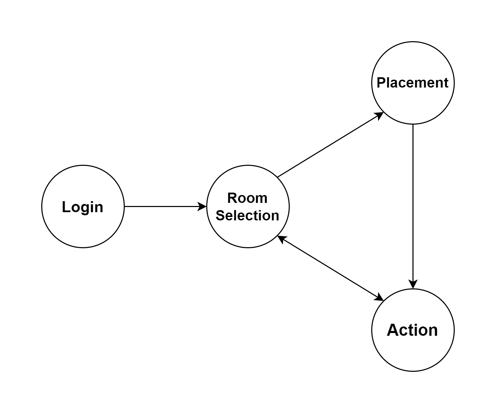
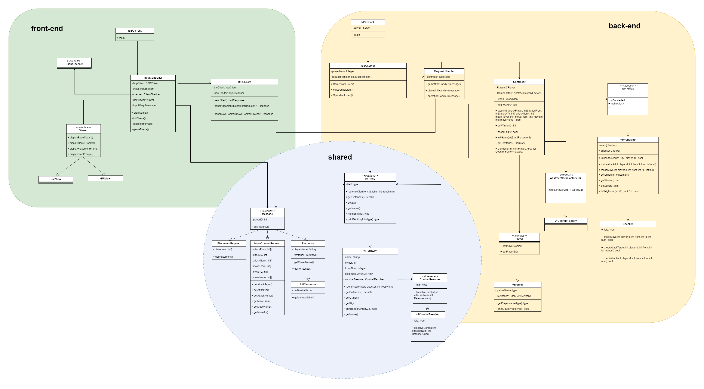

# RISC Game

**Quanzhi Fu, Yiheng Liu, Tianji Qiang, Ziyi Yang, Guowang Zeng**


## 1. Project Info

The Java RISK Game Project is a five-person team project based on Java to replicate the classic strategy game RISK. 
The project implements the core functions and game rules of the original RISK game through the Java language, while optimizing the game experience and providing a user-friendly interface. 
This project can be used as a practical case study for learning Java language programming, object-oriented programming, and game development.


## 2. Version Info

- Java11
- Gradle 7.3.3
- Springboot 2.7.10
- Jackson 2.13
- HttpClient 4.5.13


## 3. Game Flow Design

### Evo 1 Design



#### (1) Start Phase

##### Purpose: 

build connection with the server

##### Request HTTP Interface (with empty request body sent):

```http
POST /start/
```

##### Response Format:

| Parameter Name | Type        | Comments                                                     |
| -------------- | ----------- | ------------------------------------------------------------ |
| playerId       | int         | Player's Identity                                            |
| territories    | []Territory | List of Territories                                          |
| lose           | boolean     | true if the player lose the game                             |
| end            | boolean     | true if the game is over                                     |
| unitAvailable  | int         | units available for the player to place at his/her initial territories |

```json
{
    "playerId": 1,
    "territories" : [
        {
            "Name": "A",
            "TerritoryId" : 0,
            "Owner" : 1,
            "UnitNum" : 0,
            "Distance" : [0, 1, 2]
        }, 
        {
            "Name" : "B",
            "TerritoryId" : 1,
            "Owner" : 2,
            "UnitNum" : 0,
            "Distance" : [1, 0, 1]
        },
        {
            "Name" : "C",
             "TerritoryId" : 2,
            "Owner" : 0,
            "UnitNum" : 20086,
            "Distance" : [2, 1, 0]
        }
    ],
        "lose": false,
        "end": false,
    "unitAvailable": 50
}
```


*The Territory object contains:

| Parameter name | Type   | Comments                                                     |
| -------------- | ------ | ------------------------------------------------------------ |
| Name           | string | Name of the territory                                        |
| TerritoryId    | int    | Unique Identity of the territory                             |
| Owner          | int    | The player id which this territory belongs to                |
| UnitNum        | int    | Number of Units in this Territory                            |
| Distance       | []int  | Distance to other territories. Distance[i] indicate the distance toward territory with id i. |


#### (2) Placement Phase

##### Purpose: 

place units in the territories

##### Request HTTP Interface:

```http
POST /place/
```

##### Request Format: 

| Parameter name | Type  | Comments                                                     |
| -------------- | ----- | ------------------------------------------------------------ |
| PlayerId       | int   | Player's identity                                            |
| Placement      | int[] | Placement[i] denotes the number of units the plaer deployed on territory with id i. The territory not belongs to the player will be set to -1. |

```json
{
    "PlayerId": 0,
    "Placement": [
        -1, 
        20,
        30,
        50,
        -1,
        -1
    ]
}
```

##### Response Format:

Same as start stage but without unitAvailable


#### (3) Action Phase

##### Purpose: 

Game execution phase, send command to server and print view to the player

##### Request HTTP Interface:

```http
POST /act/
```

##### Request Format: 

| Parameter name | type  | comments                              |
| -------------- | ----- | ------------------------------------- |
| Player ID      | int   | Player's Identity                     |
| MoveFrom       | []int | src territories ids for move action   |
| MoveTo         | []int | des territories ids for move action   |
| MoveNums       | []int | num of units for move action          |
| AttackFrom     | []int | src territories ids for attack action |
| AttackTo       | []int | des territories ids for attack action |
| AttackNums     | []int | num of units  for attack action       |

```json
{
    "PlayerId": 1,
    "MoveFrom" : [
        0, 
        0, 
        1 
    ],
    "MoveTo" : [
        1, 
        2,
        3
    ],
    "MoveNums": [
        10,
        20,
        30
    ],
    "AttackFrom" : [
        0, 
        0, 
        1
    ],
    "AttackTo" : [
        1, 
        2,
        3
    ],
    "AttackNums": [
        10,
        20,
        30
    ]
}
```

##### Response Format:

Same as start stage but without unitAvailable


### Evo 2 Design



#### (1) Login Phase

- Ask the player to type in username and password and send it to server
- The server will register for the player if the username is new.
- Otherwise, the password will be checked and the player will be required to type again if the password fails to match the username.

##### Request HTTP Interface:

```http
POST /login/
```

##### Request Format: 

| Parameter name | type   | comments                        |
| -------------- | ------ | ------------------------------- |
| username       | String | username, unique for one player |
| password       | String | password of for that username   |

```json
{
    "username": "tenkitenki",
    "password": "riscrisc123"
}
```

##### Reponse Format:

A string indicating success or failure of login.


#### (2) Room Select Phase

- First, the player will be given with all the game room available for him/her (past games that is not over or a new game), queried by a GET request

##### Request HTTP Interface:

```http
GET /roomid/
```

##### Request Format: 

| Parameter name | type   | comments                        |
| -------------- | ------ | ------------------------------- |
| username       | String | username, unique for one player |

```json
{
    "username": "tenkitenki"
}
```

##### Reponse Format:

| Parameter name | type   | comments                                |
| -------------- | ------ | --------------------------------------- |
| username       | String | username, unique for one player         |
| roomids        | []int  | roomid available to join for the player |

```json
{
    "username": "tenkitenki",
    "roomids" : [
        10010, 
        32792, 
        8787
    ]
}
```


- Ask the player to type in the room ID to join a new game or return to a old game
- The player could also choose to exit the game here
- For the room ID，the back-end may be changed by：
    - The server will hold a hashMap with room ID corresponding to a request handler, which will handle the request for a certain game
    - a max Room ID will be maintained to ensure that every time a player enter the Room Select Phase, he/she would be able to join a new game

##### Request HTTP Interface:

```http
POST /join/{roomid}
```

##### Request Format: 

| Parameter name | type   | comments                        |
| -------------- | ------ | ------------------------------- |
| username       | String | username, unique for one player |
| roomid         | int    | ID of the room to join          |

```json
{
    "username": "tenkitenki",
    "roomid" : 8787
}
```

##### Reponse Format:

Same as Action Phase, please check that below.


#### (3) Placement Phase

##### Request HTTP Interface:

```http
POST /place/{roomid}
```

##### Request Format: 

| Parameter name | Type  | Comments                                                     |
| -------------- | ----- | ------------------------------------------------------------ |
| PlayerId       | int   | Player's identity                                            |
| Placement      | int[] | Placement[i] denotes the number of units the plaer deployed on territory with id i. The territory not belongs to the player will be set to -1. |

```json
{
    "PlayerId": 0,
    "Placement": [
        -1, 
        20,
        30,
        50,
        -1,
        -1
    ]
}
```

##### Reponse Format:

Same as Action Phase, please check that below.


#### (4) Action Phase

- Add upgrade and switch game operation based on EVO1
- The game will go back to Room Select Phase when a switch game command is received from the player or the current game is over

##### Request HTTP Interface (*potentially plan to divide into move, attack, upgrade and commit in the future):

```http
POST /act/{roomid}
```
##### Request Format: 

| Parameter name | type   | comments                        |
| -------------- | ------ | ------------------------------- |
| username       | String | username, unique for one player |
| roomid         | int    | ID of the room to join          |


```json
{
    "Username" : "qf37",
    "RoomId" : 1,
}
```

## Please update the JSON interface here, Quanzhi! (Also for the placement phase, maybe.)
#### Action (legacy)
```http
POST /act/
```
##### Request Format
##### Request HTTP Interface:

```http
POST /act/
```

##### Request Format: 

| Parameter name | type      | comments                              |
| -------------- | --------- | ------------------------------------- |
| Player ID      | int       | Player's Identity                     |
| MoveFrom       | []int     | src territories ids for move action   |
| MoveTo         | [\][]int  | des territories ids for move action   |
| MoveTroop      | []Unit    | Units to be moved                     |
| AttackFrom     | []int     | src territories ids for attack action |
| AttackTo       | []int     | des territories ids for attack action |
| AttackTroop    | [\][]Unit | Units to attack                       |
| UserName       | String    | name of the user                      |
| RoomId         | int       | room id                               |

```json
{
    "UserName": "player1",
    "RoomId": 0,
    "PlayerId": 1,
    "MoveFrom" : [
        0, 
        0, 
        1 
    ],
    "MoveTo" : [
        1, 
        2,
        3
    ],
    "MoveTroop": [[
                {
                    Name : "Guowang",
                    UnitId : 0,
                    LevelName : "primary school",
  					Level : 0,
                    CombatPts: 0
                },
                {
                    Name: "Yiheng",
                    UnitId : 1,
                    levelName : "PhD",
                    Level : 5
                    CombatPts: 11
                }
    ]],
    "AttackFrom" : [
        0, 
        0, 
        1
    ],
    "AttackTo" : [
        1, 
        2,
        3
    ],
    "AttackTroop": [[
                {
                    Name : "Quanzhi",
                    UnitId : 2,
                    LevelName : "master",
  					Level : 4,
                    CombatPts: 5
                }
    ]]
}
```

##### Response Format:

same as POST /act/commit/

#### Attack

```http
POST /act/attack/
```
##### Request Format

| Parameter name | type   | comments                            |
| -------------- | ------ | ----------------------------------- |
| Player ID      | int    | Player's Identity                   |
| From           | int    | src territoriy id for attack action |
| To             | int    | des territory id for attack action  |
| Troop          | []Unit | Units to attack                     |
| UserName       | String | name of the user                    |
| RoomId         | int    | room id                             |

```json
{
    "UserName" : "Player1",
    "RoomId" : 1,
    "PlayerId" : 0,
    "From" : 0,
    "To" : 1,
    "Troop" : [
                {
                    Name : "Guowang",
                    UnitId : 0,
                    LevelName : "primary school",
  					Level : 0,
                    CombatPts: 0
                },
                {
                    Name: "Yiheng",
                    UnitId : 1,
                    levelName : "PhD",
                    Level : 5
                    CombatPts: 11
                }
    ]
    
}
```

##### Response Format 
| Parameter name | type | comments                         |
| -------------- | ---- | -------------------------------- |
| Success        | bool | Indicate if the operation succed |
| ErrorCode      | int  | Error code to classify the error |
| Information    | int  | Information related              |


```json
{
    "Success" : False,
    "ErrorCode" : 5,
    "Information" :  "Insufficient Resources",
}
```


#### Move

```http
POST /act/move/
```
#### Upgrade Unit
```http
POST /act/upgrade_unit/
```
#### Upgrade Technology
```http
POST /act/upgrade_tech/
```

#### Move Commit

##### Request HTTP interface

```http
POST /act/commit/
```
##### Request Format:
| Parameter name | type   | comments                                |
| -------------- | ------ | --------------------------------------- |
| username       | String | username, unique for one player         |
| roomids        | []int  | roomid available to join for the player |
```json
{
    "Username": "qf37",
    "roomId": 1,
}
```
##### Response Format:
| Parameter name | type   | comments                      |
| -------------- | ------ | ----------------------------- |
| PlayerInfo     | Player | Information of players        |
| Territories    | []int  | Information of the map        |
| lose           | bool   | indicate if the play has lost |
| end            | bool   | indicate if the game was over |

```json
{
    "PlayerInfo" : {"PlayerId": 1,
                "Resources": {
               		"Tech_pts" : 30,
                	"Tood_pts" : 30,
                },
                "TechnologyLevel": 2
               },
 
    "Territories" : [
        {
            "Name": "A",
            "TerritoryId" : 0,
            "Owner" : 1,
            "Troop" : [
                {
                    Name : "Guowang",
                    UnitId : 0,
                    LevelName : "primary school",
  					Level : 0,
                    CombatPts: 0
                },
                {
                    name: "Yiheng",
                    UnitId : 1,
                    levelName : "PhD",
                    Level : 5
                    CombatPts: 11
                }
            ],
            "Cost" : 30,
            "Distance" : [0, 1, 2]
        }, 
        {
            "Name" : "B",
            "TerritoryId" : 1,
            "Owner" : 2,
            "Troop" : [
                {
                    Name : "Quanzhi",
                    LevelName : "master",
  					Level : 4,
                    CombatPts: 5
                }
            ],
            "Cost" : 30,
            "Distance" : [1, 0, 1]
        },
        {
            "Name" : "C",
             "TerritoryId" : 2,
            "Owner" : 0,
            "Troop" : [
                {
                    Name : "Tenki",
                    UnitId : 2,
                    LevelName : "middle school",
  					Level : 1,
                    CombatPts: 3
                },
                {
                    Name: "Zoe",
                    UnitId : 3,
                    LevelName : "professor",
                    Level : 6
                    CombatPts: 15
                }
            ],
            "Cost" : 30,
            "Distance" : [2, 1, 0]
        }
    ],
        "lose": false,
        "end": false,
}
```
Territory
| Parameter name | Type   | Comments                                                     |
| -------------- | ------ | ------------------------------------------------------------ |
| Name           | string | Name of the territory                                        |
| TerritoryId    | int    | Unique Identity of the territory                             |
| Owner          | int    | The player id which this territory belongs to                |
| Troop          | []Unit | Units                                                        |
| Distance       | []int  | Distance to other territories. Distance[i] indicate the distance toward territory with id i. |
| Cost           | int    | number of food need to go through the territory              |
|                |        |                                                              |

Unit
| Parameter name | Type   | Comments            |
| -------------- | ------ | ------------------- |
| Name           | string | unit name           |
| LevelName      | int    | name of this level  |
| Level          | int    | level of unit       |
| CombatPts      | int    | bonus of this level |
| UnitId         | int    | id of unit          |

Player
| Parameter name  | Type     | Comments               |
| --------------- | -------- | ---------------------- |
| PlayerId        | int      | PlayerId               |
| Resources       | Resource | Resource the unit have |
| TechnologyLevel | int      | technology level       |

Resource

| Parameter name | Type | Comments          |
| -------------- | ---- | ----------------- |
| Tech_pts       | int  | Technology points |
| Food_pts       | int  | Food points       |
|                |      |                   |

## 4. Class Design

The UML class diagram of our design is shown below:



#### Sub-module A. Front-End (client)

##### (1) RISC-Front (main)

##### (2) ClientController

Control the game logic at the client side

##### (3) Client

Manage the initial connection with server as well as the later game process including sending request and receiving response.

**Notice:**

A player loses when he no longer controls any territories.

A player who has lost may continue to watch the game if he desires, or may disconnect.

##### 	(4) View

​	Helps to present the current world. (text-based for Evo1)


#### Sub-module B. Back-End (server)

##### (1) RISC-back

Responsible for starting the server.

##### (2) Server

Responsible for receiving and parsing requests from the client, and pass it to handler for further process.

##### (3) RequestHandler

Pass the parsed request to the controller for further process, according to the different type of the command received.

##### (4) Controller

Main body for processing the game logic! 

Generate the initial state + Update the state of each turn + Check game over

**Notice:**

At the end of each turn, one new basic unit shall appear in each territory. 

Move orders effectively occur before attack orders.

Orders may not create new units nor allow a unit to be in two places at once (attacking two territories). 

When a player has won, the server should announce this to all remaining clients, which should display this information. The game then ends. 

When a player has lost, the server should automatically consider his moves to be committed (as the empty set) at the start of each turn. 

​	**a. Player**

​	**b. AbstractWorldFactory** (Abstract Factory)

​	 Generate the world (the initial territories and soldier distribution for each player) according to the number of players(use hardcode).

​	 The territories must form a connected graph (all territories must be reachable from any other territory). 

​	 Each territory shall be adjacent to one or more other territories. 

​	 Each player shall have the same number of initial units.


#### Sub-module C. Shared Library (shared)

**(1) Message**

**(2) Territory**

Each territory shall be “owned” by one player at any given time. 

**a. CombatResolver**

Responsible for the combat logic. Each territory should have an instance of this resolver. And every turn, the resolver of all territories should be traversed.

**Combat Logic:**

(a) Combat between one attacker and one defender is an iterative process which ends when one side runs out of units in the fight: 

​		i. The server rolls two 20-sided dice (one for the attacker, one for the defender). 

​		ii. The side with the lower roll loses 1 unit (in a tie, the defender wins). 

(b) If player A attacks territory X with units from multiple of her own territories, they count as a single combined force. 

(c) If multiple players attack the same territories, each attack is resolved sequentially, with the winner of the first attack being the defender in subsequent attacks. For example, if A,B, and C attack territory X held by player D, then B fights D first. If D wins, then C fights D. If C wins, then A fights C. The sequence in which the attacker’s actions are resolved should be randomly determined by the server. 

(d) If units from territory X attack territory Y, and at the same time, units from territory Y attack territory X, then they are assumed to take drastically different routes between their territories, missing each other, and ending up at their destination with no combat in the middle. For example, if all units from X attack Y, and all units from Y attack X, then (assuming no other players attack those territories) both attacks will be successful with no units lost by either side (since there will be no defenders at the start of the battle). 

**b. Checker** 

​		i. Check if adjacency of the attack command

​		ii. Check if the move action is feasible

