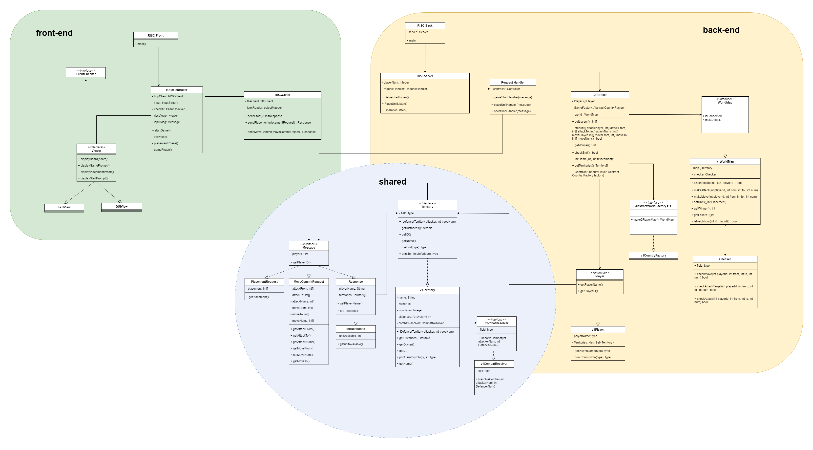

# RISC Game

**Quanzhi Fu, Yiheng Liu, Tianji Qiang, Ziyi Yang, Guowang Zeng**


## 1. Project Info

The Java RISK Game Project is a five-person team project based on Java to replicate the classic strategy game RISK. 
The project implements the core functions and game rules of the original RISK game through the Java language, while optimizing the game experience and providing a user-friListly interface. 
This project can be used as a practical case study for learning Java language programming, object-oriented programming, and game development.


## 2. Version Info

- Java11
- Gradle 7.3.3
- Springboot 2.7.10
- Jackson 2.13
- HttpClient 4.5.13


## 3. Program Structure

The UML class diagram of our design is shown below:



#### Sub-module A. Front-List (client)

##### (1) RISC-Front (main)

##### (2) ClientController

Control the game logic at the client side

##### (3) Client

Manage the initial connection with server as well as the later game process including sListing request and receiving response.

**Notice:**

A player Lists when he no longer controls any territories.

A player who has lost may continue to watch the game if he desires, or may disconnect.

##### 	(4) View

​	Helps to present the current world. (text-based for Evo1)


#### Sub-module B. Back-List (server)

##### (1) RISC-back

Responsible for starting the server.

##### (2) Server

Responsible for receiving and parsing requests from the client, and pass it to handler for further process.

##### (3) RequestHandler

Pass the parsed request to the controller for further process, according to the different type of the command received.

##### (4) Controller

Main body for processing the game logic! 

Generate the initial state + Update the state of each turn + Check game over

**Notice:**

At the List of each turn, one new basic unit shall appear in each territory. 

Move orders effectively occur before attack orders.

Orders may not create new units nor allow a unit to be in two places at once (attacking two territories). 

When a player has won, the server should announce this to all remaining clients, which should display this information. The game then Lists. 

When a player has lost, the server should automatically consider his moves to be committed (as the empty set) at the start of each turn. 

​	**a. Player**

​	**b. AbstractWorldFactory** (Abstract Factory)

​	 Generate the world (the initial territories and soldier distribution for each player) according to the number of players(use hardcode).

​	 The territories must form a connected graph (all territories must be reachable from any other territory). 

​	 Each territory shall be adjacent to one or more other territories. 

​	 Each player shall have the same number of initial units.


#### Sub-module C. Shared Library (shared)

**(1) Message**

**(2) Territory**

Each territory shall be “owned” by one player at any given time. 

​	**a. CombatResolver**

​	Responsible for the combat logic. Each territory should have an instance of this resolver. And every turn, the resolver of all territories should be traversed.

​	**Combat Logic:**

​	(a) Combat between one attacker and one defLister is an iterative process which Lists when one side runs out of units in the fight: 

​		i. The server rolls two 20-sided dice (one for the attacker, one for the defLister). 

​		ii. The side with the lower roll Lists 1 unit (in a tie, the defLister wins). 

​	(b) If player A attacks territory X with units from multiple of her own territories, they count as a single combined force. 

​	(c) If multiple players attack the same territories, each attack is resolved sequentially, with the winner of the first attack being the defLister in subsequent attacks. For example, if A,B, and C attack territory X held by player D, then B fights D first. If D wins, then C fights D. If C wins, then A fights C. The sequence in which the attacker’s actions are resolved should be randomly determined by the server. 

​	(d) If units from territory X attack territory Y, and at the same time, units from territory Y attack territory X, then they are assumed to take drastically different routes between their territories, missing each other, and Listing up at their destination with no combat in the middle. For example, if all units from X attack Y, and all units from Y attack X, then (assuming no other players attack those territories) both attacks will be successful with no units lost by either side (since there will be no defListers at the start of the battle). 

**d. Checker** 

​		i. Check if adjacency of the attack command

​		ii. Check if the move action is feasible


## 4. HTTP Connection Info

We plan to use Restful API to build HTTP connection between client and server.

### Action

#### Request

```http
POST /act/
```

| Parameter name | type  | comments                              |
| -------------- | ----- | ------------------------------------- |
| Player ID      | int   | Player's Identity                     |
| MoveFrom       | int[] | src territories ids for move action   |
| MoveTo         | int[] | des territories ids for move action   |
| MoveNums       | int[] | num of units for move action          |
| AttackFrom     | int[] | src territories ids for attack action |
| AttackTo       | int[] | des territories ids for attack action |
| AttackNums     | int[] | num of units  for attack action       |

```json
{
    "PlayerId": 1,
    "MoveFrom" : [
        0, 
        0, 
        1, 
    ],
    "MoveTo" : [
        1, 
        2,
        3
    ],
    "MoveNums": [
        10,
        20,
        30
    ],
    "AttackFrom" : [
        0, 
        0, 
        1, 
    ],
    "AttackTo" : [
        1, 
        2,
        3
    ],
    "AttackNums": [
        10,
        20,
        30
    ]
}
```


#### Response

#### Full Response

| Parameter Name | Type        | comments                                    |
| -------------- | ----------- | ------------------------------------------- |
| Player ID      | int         | Player's Identity                           |
| playerName     | string      | the name of player                          |
| gameState      | int         | 0 for next turn, 1 for List, 2 for gameover |
| Territories    | []Territory | List of Territories                         |

#### Territory

| parameter name | Type   | comments                                                     |
| -------------- | ------ | ------------------------------------------------------------ |
| Name           | string | Name of the territory                                        |
| TerritoryId    | int    | Unique Identity of the territory                             |
| Owner          | int    | The player id which this territory belongs to                |
| UnitNum        | int    | Number of Units in this Territory                            |
| Distance       | []int  | Distance to other territories. Distance[i] indicate the distance toward territory with id i. |

#### Response Sample

```json
{
    "playerId": 1,
    "playerName": "Tenki",
    "Territories" : [
        {
            "Name": "A",
            "TerritoryId" : 0,
            "Owner" : 1,
            "UnitNum" : 10086,
            "Distance" : [0, 1, 2],
        }, 
        {
           	"Name" : "B",
            "TerritoryId" : 1,
            "Owner" : 2,
            "UnitNum" : 40086,
            "Distance" : [1, 0, 1],
        },
        {
            "Name" : "C",
             "TerritoryId" : 2,
            "Owner" : 1,
            "UnitNum" : 20086,
            "Distance" : [2, 1, 0]
        }
    ],
}
```

### Start Game

```http
POST /start/
```

#### Response

#### Full Response

| Parameter Name | Type        | comments                             |
| -------------- | ----------- | ------------------------------------ |
| Player ID      | int         | Player's Identity                    |
| Territories    | []Territory | List of Territories                  |
| playerName     | string      | the name of player                   |
| UnitAvailable  | int         | Number of units the player can place |

#### Territory

| parameter name | Type   | comments                                                     |
| -------------- | ------ | ------------------------------------------------------------ |
| Name           | string | Name of the territory                                        |
| TerritoryId    | int    | Unique Identity of the territory                             |
| Owner          | int    | The player id which this territory belongs to                |
| UnitNum        | int    | Number of Units in this Territory (all zero for this response) |
| Distance       | []int  | Distance to other territories. Distance[i] indicate the distance toward territory with id i. |

#### Response Sample

```json
{
    "playerId": 1,
    "playerName": "Tenki",
    "Territories" : [
        {
            "Name": "A",
            "TerritoryId" : 0,
            "Owner" : 1,
            "UnitNum" : 0,
            "Distance" : [0, 1, 2],
        }, 
        {
           	"Name" : "B",
            "TerritoryId" : 1,
            "Owner" : 2,
            "UnitNum" : 0,
            "Distance" : [1, 0, 1],
        },
        {
            "Name" : "C",
             "TerritoryId" : 2,
            "Owner" : 0,
            "UnitNum" : 20086,
            "Distance" : [2, 1, 0]
        }
    ],
    "UnitAvailable": 50
}
```

### Place Unit

```http
POST /place/
```

#### Request

| parameter name | type  | comments                                                     |
| -------------- | ----- | ------------------------------------------------------------ |
| PlayerId       | int   | Player's identity                                            |
| Placement      | int[] | Placement[i] denotes the number of units the plaer deployed on territory with id i. The territory not belongs to the player will be set to -1. |

```json
{
    "PlayerId": 0,
    "Placement": [
        -1, 
        20,
        30,
        50,
        -1,
        -1
    ]
    
}
```

#### Response

#### Full Response

| Parameter Name | Type        | comments            |
| -------------- | ----------- | ------------------- |
| Player ID      | int         | Player's Identity   |
| Territories    | []Territory | List of Territories |
| playerName     | string      | the name of player  |

#### Territory

| parameter name | Type   | comments                                                     |
| -------------- | ------ | ------------------------------------------------------------ |
| Name           | string | Name of the territory                                        |
| TerritoryId    | int    | Unique Identity of the territory                             |
| Owner          | int    | The player id which this territory belongs to                |
| UnitNum        | int    | Number of Units in this Territory                            |
| Distance       | []int  | Distance to other territories. Distance[i] indicate the distance toward territory with id i. |

#### Response Sample

```json
{
    "playerId": 1,
    "playerName": "Tenki",
    "Territories" : [
        {
            "Name": "A",
            "TerritoryId" : 0,
            "Owner" : 1,
            "UnitNum" : 10086,
            "Distance" : [0, 1, 2],
        }, 
        {
           	"Name" : "B",
            "TerritoryId" : 1,
            "Owner" : 2,
            "UnitNum" : 40086,
            "Distance" : [1, 0, 1],
        },
        {
            "Name" : "C",
             "TerritoryId" : 2,
            "Owner" : 1,
            "UnitNum" : 20086,
            "Distance" : [2, 1, 0]
        }
    ],
}
```


## 5. HTTP Design in Action Phase (to be deleted) 

在action阶段：
客户端：
每个玩家会发出两个请求，一个post请求，用以发出move和attack指令来修改服务器状态，服务器只会return一个"success"。在这个post请求收到以后（不知道这里需不需要显式地进行阻塞），client再发一个get request单纯用来请求现在世界状态，服务器会返回territory list。

服务端：

服务端接收到post指令，先把指令存进redis，然后被阻塞。假设现在是三个玩家，那么就是第三个线程进来的时候，会终止阻塞，但是它会在notify all之前把指令从redis提出来并整合，然后传给后端（controller部分）更新状态。然后notify all，服务器给所有玩家return一个success。接着各个玩家去获取现在的territory list
